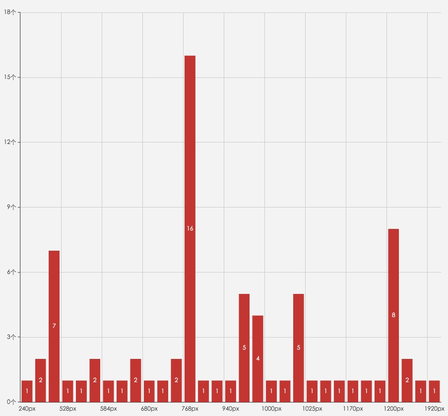
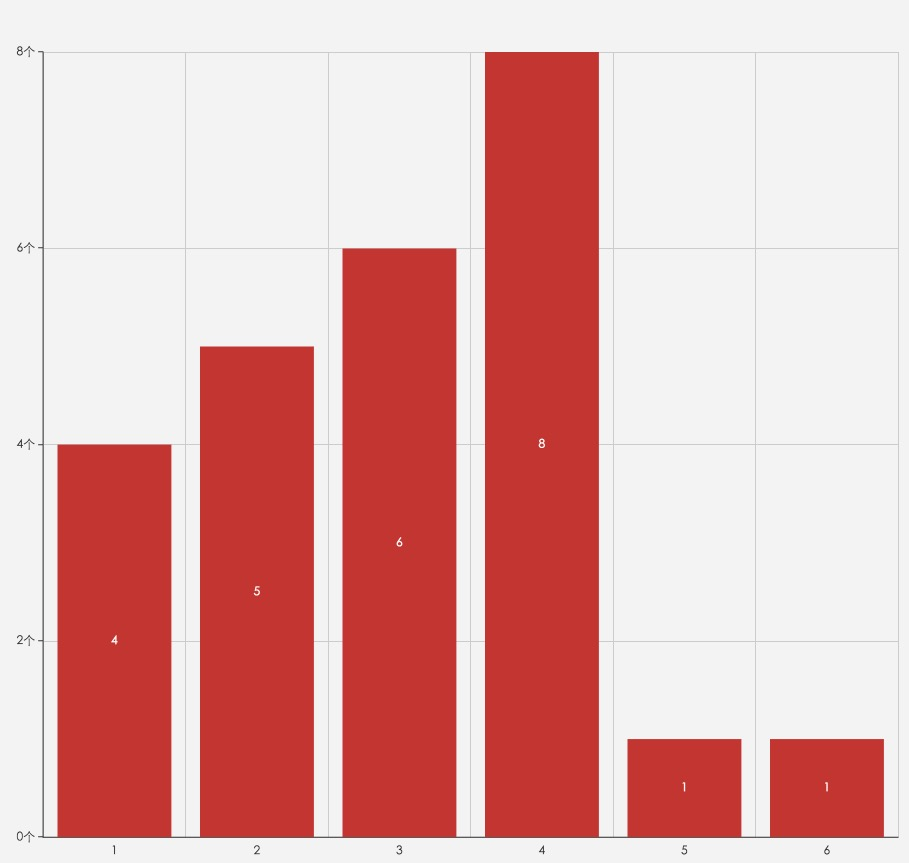
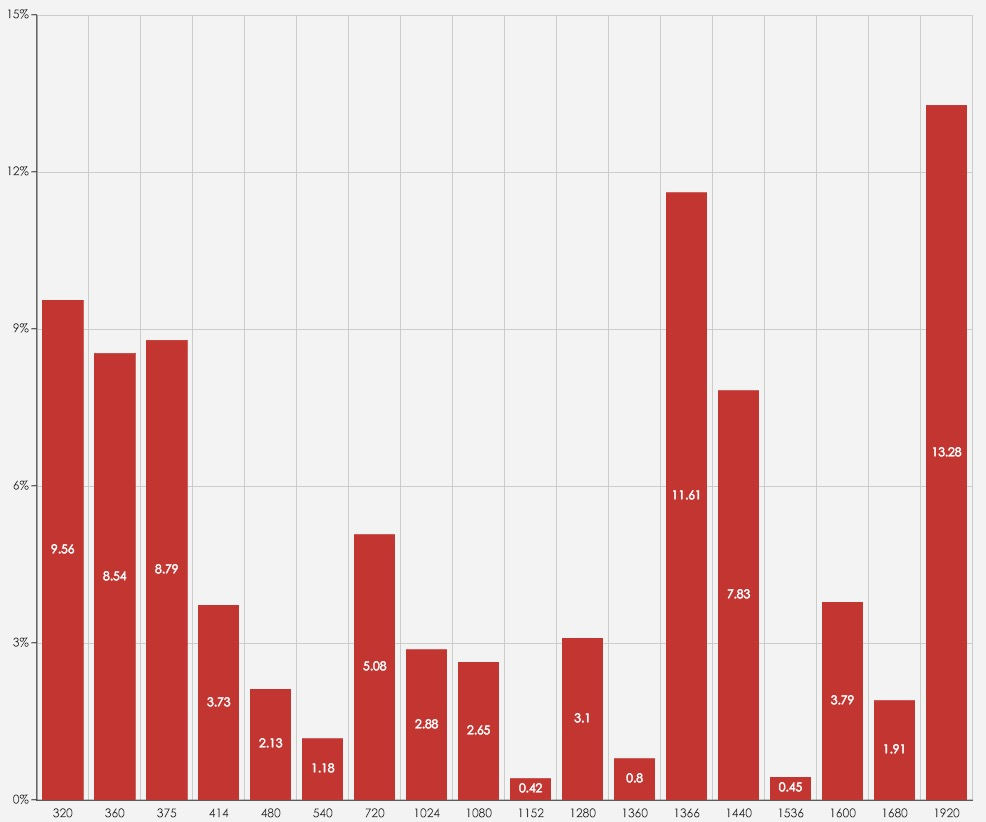

# Media Query

媒体查询将页面宽划分为几个区段，对于不同的区段来展示不同排列方式的内容。

调研几款常见响应式框架的 Media Query 方案：

||240px|400px|480px|528px|550px|568px|584px|600px|640px|680px|724px|750px|768px|800px|928px|940px|960px|992px|1000px|1020px|1024px|1025px|1120px|1140px|1170px|1175px|1180px|1200px|1280px|1380px|1920px|
|----|----|----|----|----|----|----|----|----|----|----|----|----|----|----|----|----|----|----|----|----|----|----|----|----|----|----|----|----|----|----|----|
|[Gumby](http://www.gumbyframework.com/)|✘|✘|✘|✘|✘|✘|✘|✘|✘|✘|✘|✘|✔|✘|✘|✘|✘|✘|✘|✘|✘|✘|✘|✘|✘|✘|✘|✘|✘|✘|✘|
|[uikit](http://getuikit.com/)|✘|✘|✔|✘|✘|✘|✘|✘|✘|✘|✘|✘|✔|✘|✘|✘|✔|✘|✘|✘|✘|✘|✘|✘|✘|✘|✘|✔|✘|✘|✘|
|[Foundation](http://foundation.zurb.com/)|✘|✘|✘|✘|✘|✘|✘|✘|✔|✘|✘|✘|✘|✘|✘|✘|✘|✘|✘|✘|✔|✘|✘|✘|✘|✘|✘|✘|✘|✘|✘|
|[semantic](http://semantic-ui.com/)|✘|✘|✘|✘|✘|✘|✘|✘|✘|✘|✘|✘|✔|✘|✘|✘|✘|✔|✘|✘|✘|✘|✘|✘|✘|✘|✘|✔|✘|✘|✔|
|[purecss](http://purecss.io/)|✘|✘|✘|✘|✘|✔|✘|✘|✘|✘|✘|✘|✔|✘|✘|✘|✘|✘|✘|✘|✔|✘|✘|✘|✘|✘|✘|✘|✔|✘|✘|
|[tuktuk](http://tuktuk.tapquo.com/)|✘|✘|✘|✔|✘|✘|✘|✘|✘|✘|✘|✘|✔|✘|✘|✘|✔|✘|✘|✘|✘|✘|✘|✘|✘|✘|✘|✔|✘|✘|✘|
|[kube](https://imperavi.com/kube/)|✘|✘|✘|✘|✘|✘|✘|✘|✘|✘|✘|✘|✔|✘|✘|✘|✘|✘|✘|✘|✘|✘|✘|✘|✘|✘|✘|✘|✘|✘|✘|
|[ivory](http://weice.in/ivory/)|✘|✘|✘|✘|✘|✘|✘|✘|✘|✘|✘|✘|✔|✘|✘|✘|✔|✘|✘|✘|✘|✘|✘|✘|✘|✘|✘|✘|✘|✘|✘|
|[Bootstrap](http://getbootstrap.com/)|✘|✘|✘|✘|✘|✘|✘|✘|✘|✘|✘|✘|✔|✘|✘|✘|✘|✔|✘|✘|✘|✘|✘|✘|✘|✘|✘|✔|✘|✘|✘|
|[HTML KickStart](http://www.99lime.com/elements/)|✘|✘|✔|✘|✘|✘|✘|✘|✘|✘|✘|✘|✔|✘|✘|✘|✘|✘|✘|✘|✔|✘|✘|✘|✘|✘|✘|✘|✔|✘|✘|
|[skeleton](http://getskeleton.com/)|✘|✔|✘|✘|✔|✘|✘|✘|✘|✘|✘|✔|✘|✘|✘|✘|✘|✘|✔|✘|✘|✘|✘|✘|✘|✘|✘|✔|✘|✘|✘|
|[groundwork](http://groundworkcss.github.io/groundwork/?url=docs/home)|✘|✘|✔|✘|✘|✘|✘|✘|✘|✘|✘|✘|✔|✘|✘|✘|✘|✘|✘|✘|✘|✔|✘|✘|✘|✘|✘|✘|✘|✘|✘|
|[layers](http://eiskis.net/layers/)|✘|✔|✘|✘|✘|✘|✘|✘|✔|✘|✘|✘|✘|✘|✘|✘|✘|✘|✘|✘|✘|✘|✔|✘|✘|✘|✘|✘|✘|✘|✘|
|[Cardinal](http://cardinalcss.com/)|✘|✘|✔|✘|✘|✘|✘|✔|✘|✘|✘|✘|✔|✘|✘|✘|✔|✘|✘|✘|✘|✘|✘|✔|✘|✘|✘|✘|✘|✔|✘|
|[schema](http://danmalarkey.github.io/schema/)|✘|✘|✘|✘|✘|✘|✘|✘|✘|✘|✔|✘|✘|✘|✘|✔|✘|✘|✘|✘|✘|✘|✘|✘|✔|✘|✘|✘|✘|✘|✘|
|[kickoff](http://trykickoff.com/index.html)|✘|✘|✘|✘|✘|✘|✘|✘|✘|✘|✘|✔|✘|✘|✘|✘|✘|✘|✘|✘|✘|✘|✘|✘|✘|✘|✘|✘|✘|✘|✘|
|[hoisin.scss](http://cyber-duck.github.io/hoisin.scss/)|✔|✘|✘|✘|✘|✘|✘|✘|✘|✔|✘|✘|✘|✘|✘|✘|✘|✘|✘|✘|✔|✘|✘|✘|✘|✘|✘|✘|✘|✘|✘|
|[kindling](http://timothylong.com/kindling/)|✘|✘|✘|✘|✘|✘|✘|✘|✘|✘|✘|✘|✘|✔|✘|✘|✘|✘|✘|✘|✘|✘|✘|✘|✘|✘|✘|✘|✘|✘|✘|
|[emerald](http://lmc-eu.github.io/emerald/)|✘|✘|✘|✘|✘|✘|✘|✘|✘|✘|✘|✘|✔|✘|✘|✘|✘|✘|✘|✔|✘|✘|✘|✘|✘|✘|✘|✘|✘|✘|✘|
|[sculpt](https://www.heartinternet.uk/sculpt)|✘|✘|✘|✘|✘|✘|✘|✘|✘|✘|✘|✘|✔|✘|✘|✘|✘|✘|✘|✘|✔|✘|✘|✘|✘|✔|✘|✘|✘|✘|✘|
|[furatto](http://icalialabs.github.io/furatto/index.html)|✘|✘|✔|✘|✘|✘|✘|✘|✘|✘|✘|✘|✔|✘|✘|✘|✘|✔|✘|✘|✘|✘|✘|✘|✘|✘|✘|✔|✘|✘|✘|
|[fitgrd](http://www.fitgrd.com/)|✘|✘|✘|✘|✘|✘|✔|✘|✘|✘|✘|✘|✘|✘|✔|✘|✘|✘|✘|✘|✘|✘|✘|✘|✘|✘|✘|✘|✘|✘|✘|
|[cute grids](http://www.cutegrids.com/)|✘|✘|✔|✘|✘|✘|✘|✘|✘|✘|✘|✘|✔|✘|✘|✘|✘|✔|✘|✘|✘|✘|✘|✘|✘|✘|✘|✔|✘|✘|✘|
|[gridism](http://cobyism.com/gridism/)|✘|✘|✘|✘|✘|✔|✘|✘|✘|✘|✘|✘|✘|✘|✘|✘|✘|✘|✘|✘|✘|✘|✘|✘|✘|✘|✔|✘|✘|✘|✘|
|[amazium](http://www.amazium.co.uk/)|✘|✘|✔|✘|✘|✘|✘|✘|✘|✘|✘|✘|✔|✘|✘|✘|✔|✘|✘|✘|✘|✘|✘|✘|✘|✘|✘|✔|✘|✘|✘|

取值分布为：

而分界点的个数分布为：

以2~4个为主。

媒体查询一般用作页面布局的自适应，常见而且比较经济的解决方案是：

 1. 在手机设备上，减少水平排列；
 2. 在平板以及窄屏PC上，内容布满整个屏幕，允许水平排列；
 3. 在宽屏上，内容居中显示，两边留白，增加水平排列

使用4级乃至5级划分对于研发过于复杂，没有很大必要。

下面是某产品的国内用户浏览页面宽度分布图（采样约50w）：

推荐的分界点为：___480px___ 与 ___1280px___。